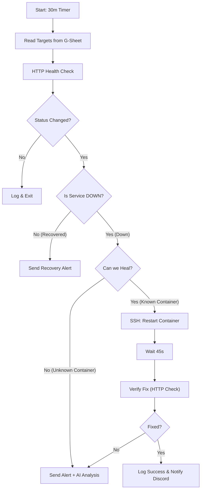

# AI-Powered Self-Healing Server Monitor

  

An automated infrastructure monitoring system built with **n8n** that detects service downtime, attempts autonomous repairs via SSH, and uses Google Gemini AI to analyze error codes.

## 🧠 Workflow Logic

The system operates on a 30-minute schedule, pulling target URLs from a Google Sheet. It follows a "Detect → Heal → Verify → Report" loop.



## ✨ Key Features

* **Autonomous Self-Healing:** Automatically restarts specific Docker containers via SSH when HTTP health checks fail.
* **AI Root Cause Analysis:** Feeds HTTP error codes and context to **Google Gemini** to generate plain-English explanations and fix suggestions.
* **Security-First Architecture:** Implements strict input sanitization and container whitelisting to prevent command injection.
* **Centralized Logging:** Records all checks, outages, and recovery timestamps in Google Sheets.
* **Real-Time Alerts:** Sends rich embed notifications to Discord with status color codes (Red for Down, Green for Recovered).

## 🛡️ Security Implementation

This workflow was designed with strict security controls to allow safe SSH execution within a home lab environment.

### 1. Input Sanitization

Before passing any data to the SSH node, the workflow sanitizes container names to remove illegal characters, preventing shell injection attacks.

```javascript
// Removes all characters except alphanumeric, dashes, and underscores
containerName = containerName.trim().replace(/[^a-zA-Z0-9\-_]/g, "");

```

### 2. Strict Whitelisting

The system enforces a "Positive Security Model." Even if a target is sanitized, the workflow **will not execute a restart command** unless the container name exists in a hardcoded `ALLOWED_CONTAINERS` array.

```javascript
const ALLOWED_CONTAINERS = [
  'nginx',
  'mysql',
  'redis',
  'app-backend'
];
// If not in list, the SSH node is skipped entirely.

```

## 🚀 Setup & Configuration

### Prerequisites

* **n8n:** Self-hosted or Cloud.
* **Google Sheets:** A sheet with columns: `Name`, `URL`, `Container_Name`, `Active_Monitoring`.
* **Discord:** Webhook URL for notifications.
* **SSH Access:** An SSH key pair configured for the n8n instance to access the Docker host.

### Google Sheets Structure

**Sheet 1: "Targets"** (Main monitoring list)
| Name | URL | Active_Monitoring | Container_Name | Current_Status | Last_Checked |
|------|-----|-------------------|----------------|----------------|--------------|
| Web Server | https://example.com | TRUE | nginx | Active | Dec 29, 3:00 PM |
| API Backend | https://api.example.com | TRUE | app-backend | DOWN | Dec 29, 3:30 PM |

**Sheet 2: "Logs"** (Auto-populated history)
| Timestamp | Target_Name | URL | Status_Code | Outcome |
|-----------|-------------|-----|-------------|---------|
| Dec 29, 3:00 PM | Web Server | https://example.com | 200 | Active |

### Installation

1. **Import Workflow**
   - Import `workflow.json` into n8n
   - All placeholder values will need updating

2. **Configure Credentials** (in n8n Settings → Credentials)
   - [ ] Google Service Account (with Sheets API enabled)
   - [ ] Discord Webhook
   - [ ] SSH Connection (to Docker host)
   - [ ] Google Gemini API Key

3. **Replace Placeholders** (3 instances each)
   - [ ] `YOUR_GOOGLE_SHEET_ID`
   - [ ] `YOUR_DISCORD_WEBHOOK_URL`

4. **Configure Container Whitelist** ⚠️ **CRITICAL**
   - Open the **"Code in JavaScript"** node
   - Edit `ALLOWED_CONTAINERS` array:
```javascript
   const ALLOWED_CONTAINERS = [
     'your-container-name-1',
     'your-container-name-2'
   ];
```

5. **Test the Workflow**
   - Manually trigger once
   - Verify Discord notifications
   - Check Google Sheets logging


## 📊 Integrations used

* **Google Sheets:** Database for targets and logs.
* **LangChain + Google Gemini:** LLM for error analysis.
* **Docker via SSH:** For remote remediation.
* **Discord:** For operational alerting.

## ⚠️ Important Notes

### SSL Certificate Validation
- The workflow has SSL validation **enabled by default** (secure)
- If monitoring services with self-signed certificates, you'll need to enable `allowUnauthorizedCerts` in the HTTP nodes
- Only do this for trusted internal services

### API Rate Limits
- **Google Gemini**: Free tier has rate limits
- **Google Sheets API**: 100 requests per 100 seconds per user
- With 30-minute checks, you can monitor ~200 targets safely

### SSH Security
- Use **key-based authentication only** (not passwords)
- Create a dedicated SSH key for n8n
- Use a restricted user with Docker permissions only

## 🔧 Troubleshooting

### "Container not in whitelist" error
- Check that the `Container_Name` in Google Sheets **exactly matches** the name in `ALLOWED_CONTAINERS`
- Container names are case-sensitive

### SSH connection fails
- Verify n8n can reach the Docker host
- Check SSH key permissions (should be 600)
- Test manually: `ssh user@host "docker ps"`

### Discord notifications not sending
- Verify webhook URL is correct
- Check Discord server permissions
- Test webhook manually with curl

### False "DOWN" alerts
- Some services return 401/403 for auth pages (these are considered "UP")
- Adjust the timeout if services are slow to respond (default: 10s)

## 📸 Screenshots
**

## 🤝 Contributing

Found a bug or have a feature idea? Open an issue or submit a PR!

## 📄 License

[MIT License](https://opensource.org/licenses/MIT) - Feel free to use this in your homelab!

## ⭐ Acknowledgments

* Built with [n8n](https://n8n.io)
* AI analysis powered by [Google Gemini](https://deepmind.google/technologies/gemini/)

---

⚡ **Quick Start:** For the fastest setup, check the [Installation](#installation) section above!
---

**⚡ Quick Start:** For the fastest setup, check the [Installation](#installation) section above!
